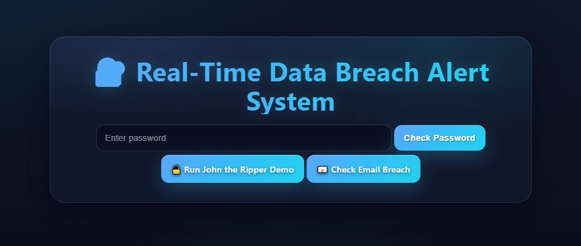
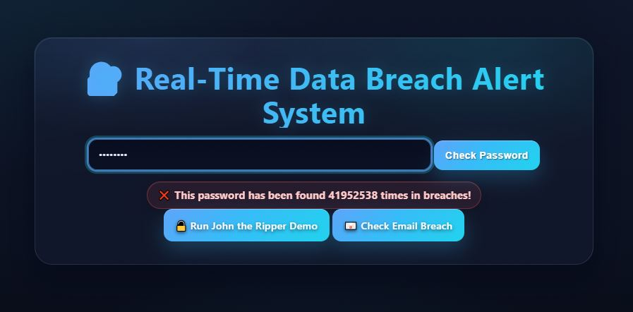

# 🔐 Real-Time Data Breach Alert System

This project is a **Flask-based web application** that allows users to:
- Check if a **password** has appeared in known data breaches (using Have I Been Pwned API).
- Check if an **email address** has been part of a breach (using XposedOrNot API).
- Run a demo of **John the Ripper** to showcase how weak passwords can be cracked.

It was developed as part of a **Cybersecurity Assignment**.

---

## 📂 Project Structure
```
/DATA-BREACH-ALERT-SYSTEM/
├── app.py                # Main Flask backend
├── index.html            # Homepage (password check UI)
├── jtr_demo.html         # John the Ripper demo results page
├── jtr-demo.pot          # JtR cracked hashes output file
├── requirements.txt      # Python dependencies
├── sample_hashes.txt     # Example SHA-1 hashes to crack
├── style.css             # Stylesheet for UI
└── wordlist.txt          # Wordlist for JtR demo
```

---

## ⚙️ Technologies Used
- **Python Flask** – Web backend
- **HTML + CSS** – Frontend
- **Requests (Python library)** – API calls
- **John the Ripper** – Password cracking demo
- **Have I Been Pwned (HIBP) API** – Password breach check
- **XposedOrNot API** – Email breach check

---

## 🚀 Setup & Installation

### 1. Clone the Repository
```bash
git clone https://github.com/Manichander123/Cybersecurity_.git
cd Cybersecurity_
```

### 2. Install Dependencies
Make sure you have **Python 3.8+** installed, then run:
```bash
pip install -r requirements.txt
```

### 3. Configure John the Ripper
- Download [John the Ripper](https://www.openwall.com/john/).
- Set an environment variable pointing to its `run/` directory:
  ```bash
  export JOHN_HOME=/path/to/john/run
  ```
  (On Windows, set this in *System Environment Variables*).

### 4. Run the Application
```bash
python app.py
```

By default, the app runs at:  
👉 [http://127.0.0.1:5000](http://127.0.0.1:5000)

---

## 🖥️ Usage

- **Password Check** → Enter a password and see if it appears in known breaches.  
- **Email Check** → Enter an email address and get a breach status report.  
- **JtR Demo** → Run a sample John the Ripper cracking session on preloaded SHA-1 hashes.

---

## 📸 Screenshots
  
  
  

---

## 📚 Learning Outcomes
- Hands-on experience with **Flask web apps**.  
- Learned how to integrate external **security APIs**.  
- Understood **SHA-1 hashing & k-anonymity** with HIBP.  
- Explored **John the Ripper** for password cracking demos.  
- Improved knowledge of **secure coding practices**.

---

## ⚠️ Disclaimer
This project is for **educational purposes only**.  
Do **not** use it to test passwords/emails without consent.

---

## 👨‍💻 Author
**K. Manichander**  
Program: Cybersecurity Assignment  
Roll No.: 160123737043  
